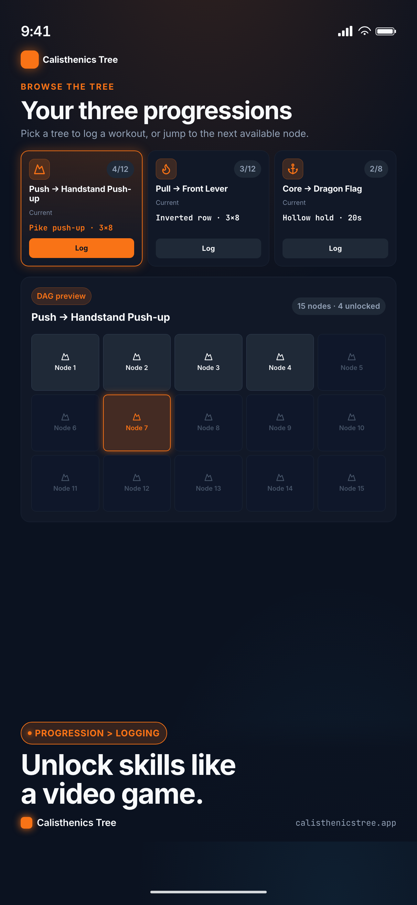

# Calisthenics Tree

A skill tree for calisthenics: unlock the handstand push-up, front lever and dragon flag one progression at a time, with smart regressions when you are fatigued.



## What it does

Bodyweight skills follow clear progressions, but most workout apps treat them as a flat list of exercises. Calisthenics Tree models each skill as a directed graph of nodes. A short placement test puts you at the right starting point, logging workouts unlocks the next node when you have earned it, and a tendon-strain model flags when to back off so connective tissue can keep up with muscle.

## Features

- **Skill trees:** push, pull, core and legs progressions stored as a DAG, with unlock rules evaluated in PostgreSQL
- **Placement onboarding:** a short questionnaire and test that places you on each tree
- **Workout logging:** a focused log with a timer and rep counter, then a completion summary
- **Promotion and regression:** nodes unlock on consistent performance and step back when you are fatigued
- **Tendon strain insights:** a load model that warns when tendon stress is outpacing recovery
- **History and search:** past workouts and searchable nodes, with public per-node landing pages
- **Friends and feed:** follow friends and see their unlocks
- **Share cards:** pre-rendered images for milestones such as clearing a tree
- **Account controls:** passwordless magic-link sign-in, data export, and soft-deleted accounts with scheduled purge
- **Gym-glare theme:** a high-contrast variant for bright gyms, plus i18n support

## Tech stack

**Backend (`apps/api`)**
- Python 3.12, FastAPI, Pydantic
- SQLAlchemy 2.0 (async) with asyncpg, PostgreSQL 16, Alembic migrations
- Magic-link auth (itsdangerous) and JWT sessions (PyJWT), rate limiting
- Optional Sentry error tracking
- pytest, ruff, uv

**Frontend (`apps/web`)**
- React 19, TypeScript, Vite, React Router
- Tailwind CSS v4 with design tokens and Radix UI primitives
- dagre for graph layout, i18next for translations
- Playwright and axe-core for end-to-end and accessibility tests, oxlint

**Infrastructure**
- Multi-stage Dockerfiles for both apps, Docker Compose, Caddy reverse proxy
- GitHub Actions CI

## Getting started

Requires Docker, Python 3.12 with [uv](https://docs.astral.sh/uv/), and Node.js.

```bash
# Database and API
docker compose up -d db
cp apps/api/.env.example apps/api/.env      # then fill in your own values
make migrate-up                            # apply migrations and seed the trees
make dev-api                               # http://localhost:8000

# Web app (separate terminal)
cp apps/web/.env.example apps/web/.env.local
cd apps/web
npm install
npm run dev                                # http://localhost:5173, proxies /api to :8000
```

Run `make` with no target to list every available command.

## Testing

```bash
make test-api      # pytest (some integration tests need DATABASE_URL and a running Postgres)
make test-web      # Playwright end-to-end, accessibility and share-card tests
make lint          # ruff + oxlint
```

CI runs backend tests, lint, the web type check and build, and Playwright on every pull request and push to `main`.

## Project structure

```
apps/
  api/
    calisthenics_api/   Routes, models, auth, placement, tendon strain, maintenance jobs
    alembic/            Migrations, including seed trees
    tests/              pytest suite
  web/
    src/pages/          Landing, onboarding, tree, workout log, insights, feed, settings
    src/components/     UI, layout and workout components
    tests/              Playwright e2e, a11y and share-card specs
    marketing/          Screenshot and video renders
docs/                   Build plan, decisions and research
```

## Further reading

- [Architecture](ARCHITECTURE.md): module layout, schema, API surface and algorithms
- [Seed data](SEED_DATA.md): tree and node inventory
- [Screen inventory](SCREEN_INVENTORY.md): every screen and its states
